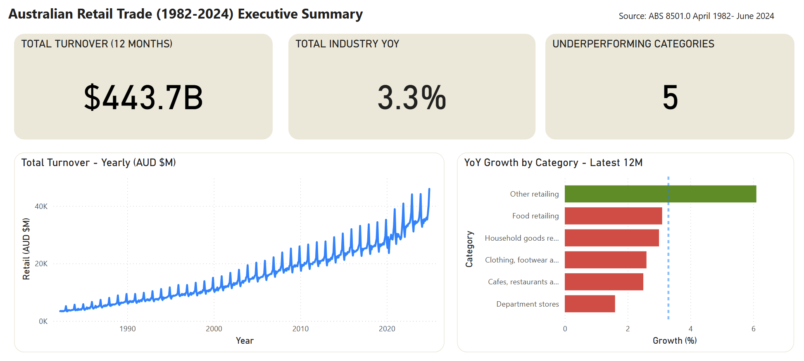
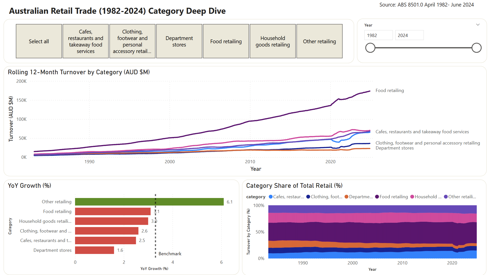
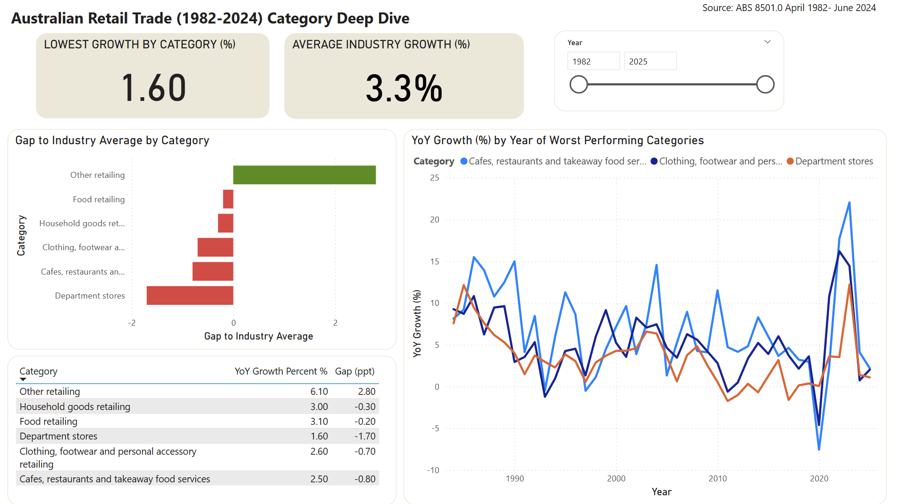

# Australian Retail Trade Performance Dashboard

> Identifying underperforming retail categories to justify a $2M promotional budget reallocation — built on ABS government data using Python, SQL, and Power BI.

---

## The Business Problem

Australian retail turnover grew 3.3% nationally in the 12 months to June 2025 (ABS Cat. 8501.0) — but that headline masks significant divergence across categories. A national retailer's CFO needs to know where growth is concentrated and where promotional spend is being wasted on declining categories.

**The question:** Which retail categories are underperforming the national benchmark, and by how much?

---

## Key Findings

| Category | YoY Growth | vs Benchmark | Status |
|---|---|---|---|
| Other retailing | 6.1% | +2.8 ppt | ✅ Outperforming |
| Food retailing | 3.1% | −0.2 ppt | 🔴 Underperforming |
| Household goods | 3.0% | −0.3 ppt | 🔴 Underperforming |
| Clothing & footwear | 2.6% | −0.7 ppt | 🔴 Underperforming |
| Cafes & restaurants | 2.5% | −0.8 ppt | 🔴 Underperforming |
| Department stores | 1.6% | −1.7 ppt | 🔴 Underperforming |

**National benchmark (Total Industry): 3.3% YoY**

5 out of 6 categories are growing below the national benchmark. Department stores are the worst performer at 1.6% — 1.7 percentage points below the market. Only Other retailing is outperforming.

**Recommendation:** Reallocate promotional spend away from Department stores, Cafes, and Clothing toward Other retailing, which is the only category compounding above the national benchmark.
## Dashboard Preview





---

## Data Pipeline

```
850101.xlsx (ABS)
    │
    ▼
01_cleaning.ipynb
    │  → retail_clean.csv
    ▼
02_feature_engineering.ipynb
    │  → retail_yoy_growth.csv    (joins retail_clean on date + category)
    │  → retail_benchmark.csv     (joins retail_clean on date)
    │  → retail_category_ranking.csv  (joins retail_yoy_growth on category)
    ▼
Power BI Dashboard (retail_dashboard.pbix)
    │
    ▼
CFO Brief (output/cfo_brief.pdf)
```


## Repository Structure

```
Australian-Retail-Trade-Performance/
├── data/
│   ├── raw/                          ← 850101.xlsx (not committed — see README)
│   ├── processed/                    ← all feature-engineered CSVs
│   │   ├── retail_clean.csv
│   │   ├── retail_yoy_growth.csv
│   │   ├── retail_benchmark.csv
│   │   └── retail_category_ranking.csv
│   └── database/
│       └── retail.db                 ← SQLite database
├── notebooks/
│   ├── 01_cleaning.ipynb             ← raw Excel → retail_clean.csv
│   └── 02_feature_engineering.ipynb ← clean data → analytical tables
├── sql/
│   └── queries.sql                   ← 4 business SQL queries
├── powerbi/
│   └── retail_dashboard.pbix         ← Power BI dashboard
├── output/
│   └── eda_timeseries.png
│   └── eda_seasonality.png
│   └── eda_distributions.png
│   └── eda_correlation.png
│   └── dashboard_executive_summary.png
│   └── dashboard_category_deepdive.png
│   └── dashboard_underperformer.png
│   └── cfo_brief.pdf                 ← 1-page CFO brief
├── requirements.txt
└── README.md
```


## Data Source

| Dataset | Source | Coverage | Frequency |
|---|---|---|---|
| Retail Trade Table 1 | ABS Cat. 8501.0 | Apr 1982 – present | Monthly |

**File:** `850101.xlsx` — national retail turnover by industry group. Original series only (Seasonally Adjusted and Trend series excluded).


## Tool Stack

| Tool | Purpose |
|---|---|
| Python (pandas) | Data cleaning and feature engineering |
| SQLite + jupysql | SQL analysis and business queries |
| Power BI Desktop | Interactive dashboard |
| Jupyter Notebook | Analysis pipeline |

## Data Model

```
dim_date ────── date ──────── retail_clean
             ├── date ──────── retail_yoy_growth
             └── date ──────── retail_benchmark

retail_yoy_growth ── category ── retail_category_ranking
```

---

## SQL Queries

Four business-focused queries are in `sql/queries.sql`:

1. **YoY growth by category** — annual turnover comparison, worst performers first
2. **Current underperformers** — rolling 12-month comparison anchored to latest data date
3. **Seasonal patterns** — average monthly turnover per category (post-2015)
4. **Category share shift** — structural change in market share over time


## Skills Demonstrated

`Python` `pandas` `SQL` `SQLite` `Power BI` `DAX` `Data Cleaning` `Feature Engineering` `EDA` `Data Modelling` `Business Communication`

---